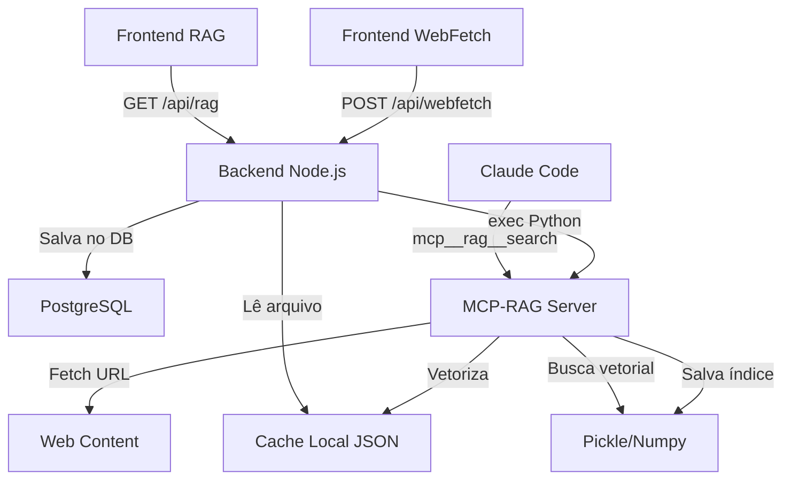

# Análise Completa da Arquitetura RAG do Projeto

## 1. Visão Geral da Arquitetura

O projeto implementa um sistema RAG (Retrieval-Augmented Generation) híbrido que integra:
- **Backend Node.js/TypeScript** com Fastify e Hono
- **Frontend React** com componentes dedicados
- **Servidor MCP Python** independente
- **Banco de dados PostgreSQL** para persistência
- **Cache local** em ~/.claude/mcp-rag-cache

## 2. Componentes Backend

### 2.1 rag-routes.ts
- **Função**: API REST para gerenciar documentos RAG
- **Endpoints**:
  - `GET /rag/documents` - Lista documentos do cache local
  - `POST /rag/search` - Busca simples por palavras-chave
  - `DELETE /rag/document/:id` - Remove documento
  - `POST /rag/sync` - Sincronização (não implementada)
- **Características**:
  - Lê diretamente do arquivo JSON local
  - Busca básica por score de palavras-chave
  - Sem vetorização real

### 2.2 mcp-rag-integration.ts
- **Função**: Ponte entre backend Node.js e servidor MCP Python
- **Métodos principais**:
  - `indexWebFetchDoc()` - Dispara indexação via Python
  - `searchRAG()` - Busca no índice vetorial
  - `checkHealth()` - Verifica status do sistema
- **Características**:
  - Usa `exec()` para chamar Python (não ideal)
  - Processa indexações pendentes em background
  - Worker automático a cada 30 segundos

### 2.3 webfetch-routes.ts
- **Função**: API para gerenciar documentações web
- **Endpoints**:
  - CRUD completo para documentações
  - Busca integrada com RAG
  - Estatísticas e histórico
  - Indexação em batch
- **Integração DB**: Schema completo com 3 tabelas

### 2.4 Schema do Banco (webfetch-docs.ts)
- **webfetch_docs**: Documentações principais
  - Status: pending, indexing, indexed, failed, archived
  - Metadados: categoria, tags, auto-update
  - Estatísticas: searchCount, lastSearched
- **webfetch_subpages**: Páginas filhas indexadas
- **webfetch_search_history**: Histórico de buscas

## 3. Componentes Frontend

### 3.1 RAGManager.tsx
- **Função**: Interface completa para gerenciar cache RAG
- **Features**:
  - Dashboard com estatísticas
  - Visualização de documentos
  - Busca local
  - Export de dados
- **Limitações**: Usa dados mockados parcialmente

### 3.2 RAGManagerSimple.tsx
- **Função**: Versão simplificada do RAGManager
- **Características**: Interface minimalista, sem shadcn/ui

### 3.3 WebFetchManager.tsx
- **Função**: Gerenciar URLs para indexação
- **Features**:
  - Adicionar URLs com categorias e tags
  - Controle de profundidade de indexação
  - Auto-update configurável
  - Dashboard com métricas

## 4. Servidor MCP RAG (Python)

### 4.1 server.py
- **Classe RAGIndex**: 
  - Vetorização real com TF-IDF/scikit-learn
  - Busca por similaridade de cosseno
  - Persistência em pickle/numpy
- **Integrações**:
  - Claude Sessions
  - WebFetch
- **Tools MCP**:
  - `rag_search` - Busca vetorial
  - `rag_index` - Indexa conteúdo
  - `rag_webfetch` - Captura e indexa web
  - `rag_create_knowledge_base` - Batch de URLs

### 4.2 webfetch_integration.py
- **Função**: Captura inteligente de documentações web
- **Features**:
  - Configurações por domínio
  - Extração de estrutura (h1, h2, h3)
  - Indexação recursiva de subpáginas
  - BeautifulSoup para parsing

## 5. Fluxo de Dados Atual



## 6. Pontos Fortes

1. **Arquitetura Modular**: Separação clara entre captura, indexação e busca
2. **Vetorização Real**: TF-IDF com scikit-learn no servidor MCP
3. **Persistência Múltipla**: DB para metadados, arquivos para vetores
4. **Integração MCP Nativa**: Tools funcionais para Claude Code
5. **WebFetch Inteligente**: Parsing específico por domínio
6. **Interface Rica**: Dashboard completo no frontend

## 7. Gaps e Melhorias Necessárias

### 7.1 Problemas Críticos
1. **Comunicação Backend-MCP via exec()**: 
   - Inseguro e ineficiente
   - Sem tratamento de erros adequado
   - Deveria usar stdio ou HTTP

2. **Duplicação de Funcionalidade**:
   - Backend tem busca própria (básica)
   - MCP tem busca vetorial (avançada)
   - Falta unificação

3. **Sincronização Manual**:
   - Cache local e DB não sincronizam automaticamente
   - Risco de inconsistência de dados

### 7.2 Melhorias Sugeridas

1. **Unificar Busca**:
   ```typescript
   // Em vez de busca local no backend
   async function search(query: string) {
     return await mcpClient.callTool('rag_search', { query })
   }
   ```

2. **Cliente MCP Proper**:
   ```typescript
   import { MCPClient } from '@modelcontextprotocol/sdk'
   
   const mcpClient = new MCPClient({
     transport: 'stdio',
     command: 'python',
     args: ['/path/to/server.py']
   })
   ```

3. **Sincronização Bidirecional**:
   - MCP notifica backend após indexação
   - Backend atualiza DB com resultados
   - Frontend recebe updates via WebSocket

4. **Melhor Gestão de Estado**:
   ```typescript
   // Redux ou Zustand para estado global
   const useRAGStore = create((set) => ({
     documents: [],
     searchResults: [],
     indexingQueue: [],
     syncWithMCP: async () => { /* ... */ }
   }))
   ```

5. **Embeddings Modernos**:
   ```python
   # Substituir TF-IDF por embeddings modernos
   from sentence_transformers import SentenceTransformer
   model = SentenceTransformer('all-MiniLM-L6-v2')
   ```

## 8. Arquitetura Recomendada

```
┌─────────────────┐     ┌──────────────────┐     ┌─────────────────┐
│   Frontend      │────▶│   Backend API    │────▶│   PostgreSQL    │
│   React SPA     │     │   (Fastify)      │     │   (Metadata)    │
└─────────────────┘     └──────────────────┘     └─────────────────┘
                               │
                               │ MCP Protocol
                               ▼
                        ┌──────────────────┐
                        │  MCP-RAG Server  │
                        │   (Python)       │
                        └──────────────────┘
                               │
                        ┌──────┴──────┐
                        ▼             ▼
                  ┌──────────┐  ┌──────────┐
                  │  Vector  │  │   LLM    │
                  │  Store   │  │ Embeddings│
                  └──────────┘  └──────────┘
```

## 9. Próximos Passos

1. **Implementar cliente MCP proper no backend**
2. **Unificar sistema de busca**
3. **Adicionar WebSocket para updates em tempo real**
4. **Migrar para embeddings modernos**
5. **Implementar cache de resultados com Redis**
6. **Adicionar testes de integração**

## 10. Conclusão

A arquitetura atual é funcional mas fragmentada. O sistema tem todos os componentes necessários mas precisa de melhor integração entre eles. A principal melhoria seria centralizar toda lógica RAG no servidor MCP e usar o backend apenas como proxy/orquestrador, mantendo o PostgreSQL para metadados e auditoria.