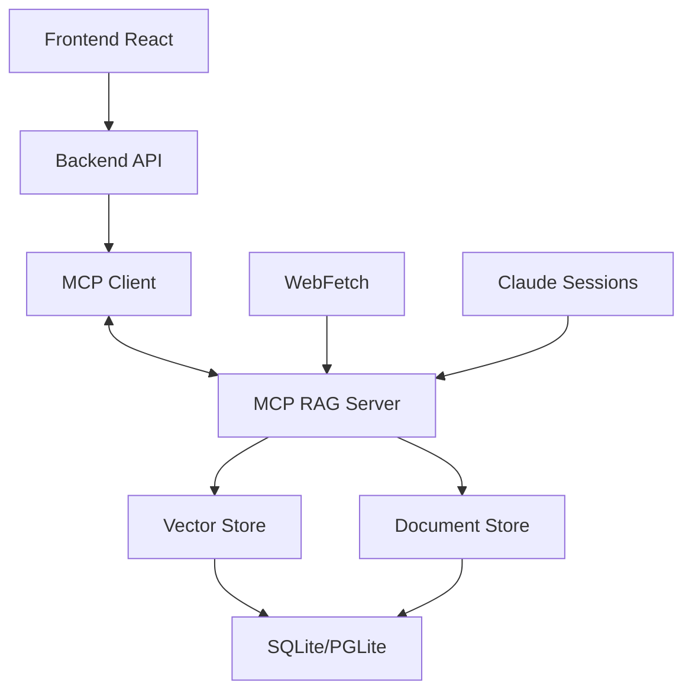

# Plano de Alinhamento RAG - MCP Integration

## Estado Atual vs Estado Desejado

### 🔴 Estado Atual
- Backend chama servidor MCP via exec() (inseguro e lento)
- Dois sistemas de busca separados (backend básico + MCP vetorial)
- Cache local e PostgreSQL não sincronizam automaticamente
- Frontend tem dados mockados em alguns componentes

### 🟢 Estado Desejado
- Comunicação nativa via protocolo MCP (stdio/HTTP)
- Sistema unificado de busca vetorial
- Sincronização automática e bidirecional
- Frontend 100% conectado com dados reais

## Roadmap de Implementação

### Fase 1: Fundação (1-2 semanas)
1. **Substituir exec() por cliente MCP nativo**
   - Implementar cliente TypeScript MCP no backend
   - Usar stdio para comunicação com servidor Python
   - Manter retrocompatibilidade

2. **Persistência unificada**
   - Migrar cache JSON para SQLite/PGLite
   - Implementar sincronização automática
   - Adicionar versionamento de documentos

### Fase 2: Melhorias Core (2-3 semanas)
3. **Modernizar vetorização**
   - Migrar de TF-IDF para sentence-transformers
   - Implementar cache de embeddings
   - Adicionar suporte a chunking inteligente

4. **API unificada**
   - Centralizar todas operações RAG no servidor MCP
   - Backend apenas como proxy/auth
   - WebSocket para updates em tempo real

### Fase 3: Features Avançadas (3-4 semanas)
5. **Indexação inteligente**
   - Queue de processamento assíncrono
   - Parsers específicos por tipo (MD, PDF, etc)
   - Deduplicação automática

6. **Busca avançada**
   - Hybrid search (keyword + semantic)
   - Filtros por metadata
   - Reranking com cross-encoders

## Arquitetura Alvo



## Quick Wins (Implementar Agora)

1. **Adicionar ferramenta `add_batch` ao MCP**
```python
@server.tool()
async def add_batch(urls: List[str]) -> str:
    results = []
    for url in urls:
        content = await fetch_url(url)
        doc_id = await index_document(content)
        results.append(doc_id)
    return f"Indexed {len(results)} documents"
```

2. **Script de migração do cache**
```python
# migrate_cache.py
import json
import sqlite3
from pathlib import Path

def migrate_to_sqlite():
    cache_dir = Path.home() / ".claude" / "mcp-rag-cache"
    docs = json.load(open(cache_dir / "documents.json"))
    
    conn = sqlite3.connect(cache_dir / "rag.db")
    # ... migration logic
```

3. **Conectar frontend com dados reais**
```typescript
// RAGManagerSimple.tsx
const loadDocuments = async () => {
  const response = await fetch('/api/rag/documents');
  const data = await response.json();
  setDocuments(data.documents);
};
```

## Métricas de Sucesso
- [ ] Tempo de busca < 100ms para 10k documentos
- [ ] Zero dados mockados no frontend
- [ ] 100% das operações via protocolo MCP
- [ ] Sincronização automática cache ↔ DB
- [ ] Suporte a 5+ formatos de arquivo

## Próximos Passos
1. Implementar cliente MCP TypeScript
2. Criar migration script para SQLite
3. Atualizar frontend para usar API real
4. Adicionar testes de integração