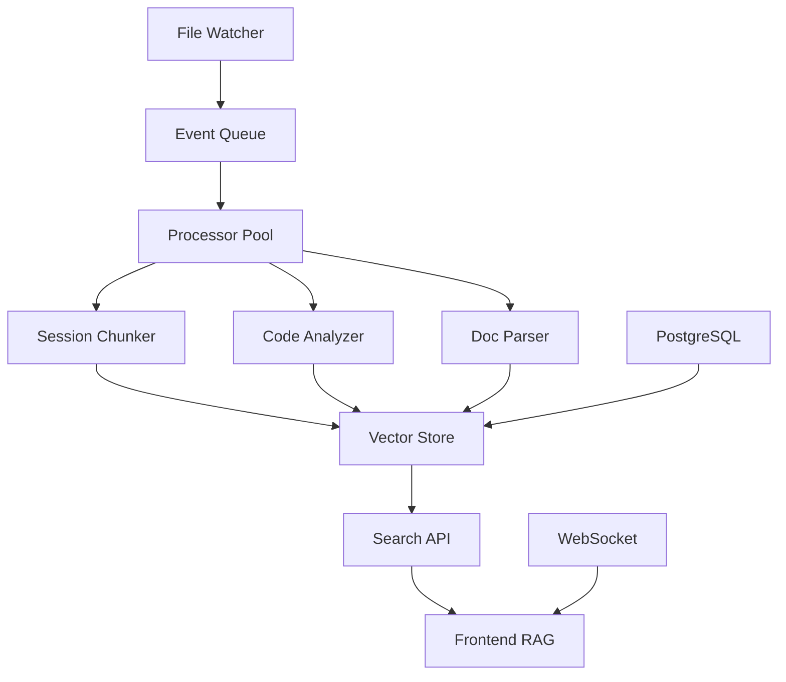

# RAG em Tempo Real - Roadmap Completo

## Visão: Um Sistema RAG que Conhece Tudo do Projeto

### 🎯 Capacidades Planejadas

1. **Indexação Automática em Tempo Real**
   - ✅ Sessões Claude (.jsonl) - chunking inteligente
   - ✅ TODOs (.json) - status e prioridades
   - 🔄 Código (.ts, .tsx, .py) - funções e imports
   - 🔄 Documentos (.md) - estrutura e conteúdo
   - 🔄 WebFetch - URLs externas

2. **Fontes de Dados Integradas**
   ```
   RAG Central
   ├── Sessões Claude (histórico completo)
   ├── TODOs (progresso do projeto)
   ├── Código (contexto técnico)
   ├── Docs (conhecimento do projeto)
   ├── WebFetch (conhecimento externo)
   └── PostgreSQL (metadados estruturados)
   ```

3. **Benefícios Imediatos**
   - Buscar em TODAS as conversas passadas
   - Encontrar decisões técnicas tomadas
   - Rastrear evolução de features
   - Conectar TODOs com implementações
   - Documentação sempre atualizada

## 📊 Arquitetura de Indexação em Tempo Real



## 🚀 Implementação por Fases

### Fase 1: Indexação de Sessões (1 semana)
- [x] Chunking de sessões grandes
- [x] Extração de conteúdo relevante
- [ ] Indexação incremental
- [ ] Deduplicação automática

### Fase 2: Monitoramento em Tempo Real (1 semana)
- [x] File watcher básico
- [ ] Queue de processamento
- [ ] Workers assíncronos
- [ ] Retry e error handling

### Fase 3: Análise de Código (2 semanas)
- [ ] Parser para TypeScript/React
- [ ] Extração de dependências
- [ ] Grafo de componentes
- [ ] Documentação automática

### Fase 4: Integração Total (1 semana)
- [ ] Sincronização PostgreSQL ↔ Cache
- [ ] WebSocket para updates
- [ ] API unificada de busca
- [ ] Dashboard de monitoramento

## 💡 Casos de Uso Poderosos

1. **"Quando decidimos usar Drizzle?"**
   - Busca em sessões antigas
   - Mostra contexto da decisão
   - Links para implementação

2. **"Quais TODOs mencionam RAG?"**
   - Busca em todos os TODOs
   - Histórico de mudanças
   - Status atual

3. **"Como funciona o componente X?"**
   - Análise do código
   - Documentação relacionada
   - Discussões sobre ele

4. **"O que mudou esta semana?"**
   - Timeline de mudanças
   - Commits + TODOs + Sessões
   - Visão consolidada

## 🔧 Configuração Sugerida

```python
# config_rag_realtime.py
INDEXING_CONFIG = {
    'watch_dirs': [
        '~/.claude/projects',
        '~/.claude/todos',
        './src',
        './docs'
    ],
    'file_types': {
        '.jsonl': {'chunking': True, 'chunk_size': 1000},
        '.json': {'chunking': False},
        '.ts': {'analyze': True, 'extract': ['imports', 'exports']},
        '.md': {'parse': True, 'extract': ['headers', 'links']}
    },
    'indexing': {
        'batch_size': 10,
        'workers': 4,
        'debounce_ms': 1000
    }
}
```

## 📈 Métricas de Sucesso

- [ ] Indexação < 100ms por arquivo
- [ ] Busca < 50ms (99 percentil)
- [ ] 100% dos arquivos monitorados
- [ ] Zero perda de eventos
- [ ] Updates em tempo real < 1s

## 🎨 Interface Ideal

```
┌─────────────────────────────────────────┐
│ RAG Search                    [🔍]      │
├─────────────────────────────────────────┤
│ Filtros:                                │
│ □ Sessões  □ TODOs  □ Código  □ Docs  │
│ Data: [Última semana ▼]                 │
├─────────────────────────────────────────┤
│ Resultados (247):                       │
│                                         │
│ 📄 Session: "Implementando RAG..."      │
│    ...decidimos usar TF-IDF por...     │
│    ⏰ 2 dias atrás                     │
│                                         │
│ 💻 Code: rag-routes.ts                  │
│    function searchDocuments(query)...   │
│    ⏰ 3 horas atrás                    │
│                                         │
│ ✅ TODO: "Integrar RAG com frontend"    │
│    Status: In Progress                  │
│    ⏰ Hoje                              │
└─────────────────────────────────────────┘
```

## 🚦 Próximos Passos

1. **Imediato**: Ativar file watcher para sessões
2. **Esta semana**: Integrar com servidor MCP
3. **Próxima semana**: Frontend com busca unificada
4. **Futuro**: ML para sugestões inteligentes

Com isso, seu RAG vai ser uma verdadeira "memória viva" do projeto!