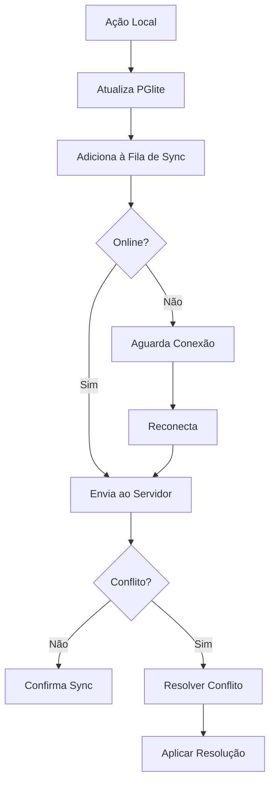

# Guia de Gestão de Conflitos - Sistema de Missões

## Situação Atual

Atualmente, o sistema de missões **NÃO possui gestão de conflitos**. As operações são executadas de forma síncrona e direta:

### Deleção Atual
```typescript
// Backend: missions-routes.ts
app.delete('/missions/:id', async (request, reply) => {
  // Deleta diretamente do banco sem soft delete
  await db.delete(missions).where(eq(missions.id, id));
  return reply.status(204).send();
});
```

### Problemas da Abordagem Atual
1. **Sem Offline Support**: Requer conexão constante com o servidor
2. **Perda de Dados**: Deleções são permanentes e irreversíveis
3. **Sem Histórico**: Não há registro de mudanças ou auditoria
4. **Race Conditions**: Múltiplos usuários podem causar conflitos

## Estratégia Proposta para Gestão de Conflitos

### 1. Soft Delete com Tombstones

```typescript
// Schema atualizado com soft delete
export const missions = pgTable('missions', {
  id: serial().primaryKey(),
  title: text().notNull(),
  // ... outros campos
  deletedAt: timestamp({ withTimezone: true }),
  deletedBy: text(),
  version: integer().default(1).notNull(),
  lastModified: timestamp({ withTimezone: true }).defaultNow().notNull()
});
```

### 2. Sistema de Versionamento

```typescript
interface ConflictResolution {
  strategy: 'last-write-wins' | 'manual' | 'merge';
  
  async resolve(local: Mission, remote: Mission): Promise<Mission> {
    switch (this.strategy) {
      case 'last-write-wins':
        return local.lastModified > remote.lastModified ? local : remote;
      
      case 'manual':
        return await this.promptUserResolution(local, remote);
      
      case 'merge':
        return this.autoMerge(local, remote);
    }
  }
}
```

### 3. Event Sourcing para Auditoria

```typescript
export const missionEvents = pgTable('mission_events', {
  id: serial().primaryKey(),
  missionId: integer().notNull(),
  eventType: text().notNull(), // 'created', 'updated', 'deleted', 'restored'
  userId: text().notNull(),
  timestamp: timestamp({ withTimezone: true }).defaultNow().notNull(),
  previousData: jsonb(),
  newData: jsonb(),
  deviceId: text(), // Para rastrear origem das mudanças
});
```

### 4. Implementação com PGlite (Local-First)

```typescript
class LocalFirstMissions {
  private localDb: PGlite;
  private syncEngine: SyncEngine;
  
  async deleteMission(id: number) {
    // 1. Marca como deletado localmente
    await this.localDb.query(`
      UPDATE missions 
      SET deleted_at = NOW(), 
          version = version + 1
      WHERE id = $1
    `, [id]);
    
    // 2. Cria evento de deleção
    await this.localDb.query(`
      INSERT INTO sync_queue (operation, entity_type, entity_id, data)
      VALUES ('delete', 'mission', $1, $2)
    `, [id, { deletedAt: new Date() }]);
    
    // 3. Tenta sincronizar (se online)
    if (navigator.onLine) {
      await this.syncEngine.sync();
    }
  }
}
```

### 5. Resolução de Conflitos Específicos

#### Conflito: Deleção vs Edição
```typescript
async resolveDeleteEditConflict(local: Mission, remote: Mission) {
  if (local.deletedAt && !remote.deletedAt) {
    // Local deletou, remoto editou
    if (remote.lastModified > local.deletedAt) {
      // Edição é mais recente - restaurar
      return { ...remote, deletedAt: null };
    } else {
      // Deleção é mais recente - manter deletado
      return local;
    }
  }
}
```

#### Conflito: Edições Simultâneas
```typescript
async resolveConcurrentEdits(local: Mission, remote: Mission) {
  // Estratégia de merge campo por campo
  const merged: Mission = {
    id: local.id,
    title: local.title !== remote.title 
      ? `${local.title} / ${remote.title}` // Combina títulos
      : local.title,
    description: this.mergeText(local.description, remote.description),
    status: this.resolveStatus(local.status, remote.status),
    lastModified: new Date(),
    version: Math.max(local.version, remote.version) + 1
  };
  
  return merged;
}
```

### 6. UI para Gestão de Conflitos

```typescript
// Componente React para resolver conflitos manualmente
function ConflictResolver({ conflicts }: { conflicts: Conflict[] }) {
  return (
    <div className="conflict-resolver">
      {conflicts.map(conflict => (
        <div key={conflict.id} className="conflict-item">
          <h3>Conflito em: {conflict.mission.title}</h3>
          
          <div className="versions">
            <div className="local-version">
              <h4>Sua versão</h4>
              <MissionPreview mission={conflict.local} />
            </div>
            
            <div className="remote-version">
              <h4>Versão do servidor</h4>
              <MissionPreview mission={conflict.remote} />
            </div>
          </div>
          
          <div className="actions">
            <button onClick={() => conflict.resolve('local')}>
              Manter minha versão
            </button>
            <button onClick={() => conflict.resolve('remote')}>
              Usar versão do servidor
            </button>
            <button onClick={() => conflict.resolve('merge')}>
              Mesclar ambas
            </button>
          </div>
        </div>
      ))}
    </div>
  );
}
```

## Tecnologias Recomendadas

### Para CRDTs (Conflict-free Replicated Data Types)
- **Yjs**: Para colaboração em tempo real
- **Automerge**: Para sincronização P2P
- **Loro**: CRDT de alta performance

### Para Sincronização
- **Replicache**: Cliente de sincronização otimista
- **Electric SQL**: Sincronização PostgreSQL
- **TanStack DB**: Store reativo com suporte a sync

## Fluxo de Sincronização Proposto



## Métricas de Sucesso

1. **Zero perda de dados** mesmo offline
2. **Resolução automática** de 90% dos conflitos
3. **UI clara** para conflitos manuais
4. **Histórico completo** de todas as operações
5. **Sincronização em < 3 segundos** quando online

## Próximos Passos

1. Implementar soft delete no schema atual
2. Adicionar versionamento às missões
3. Criar tabela de eventos
4. Implementar sync básico com queue
5. Adicionar UI de resolução de conflitos
6. Testar cenários de conflito